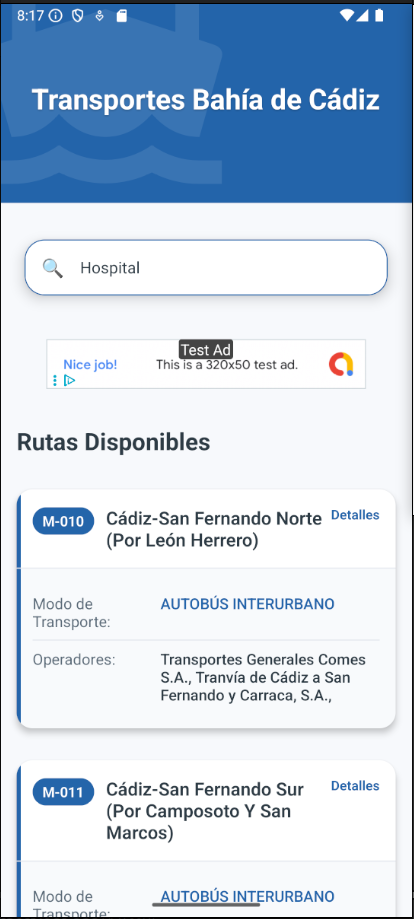
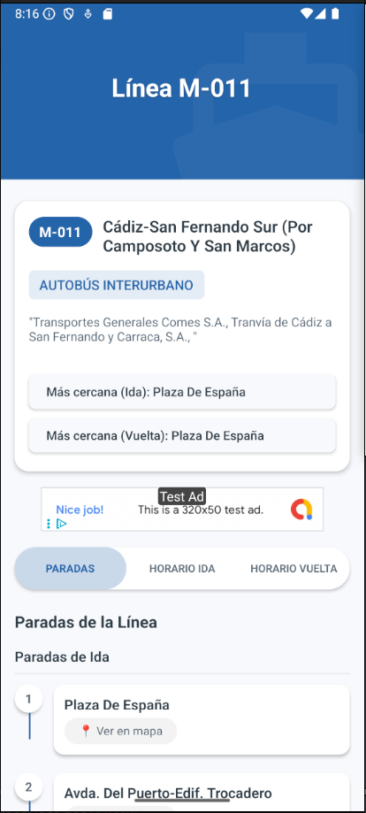
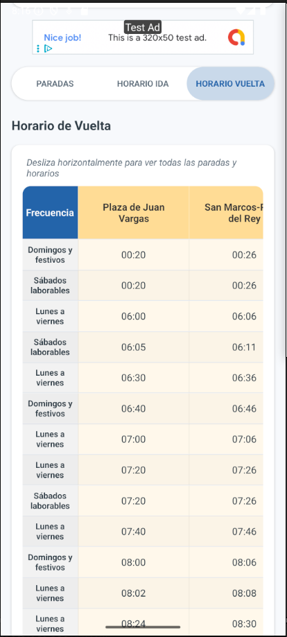
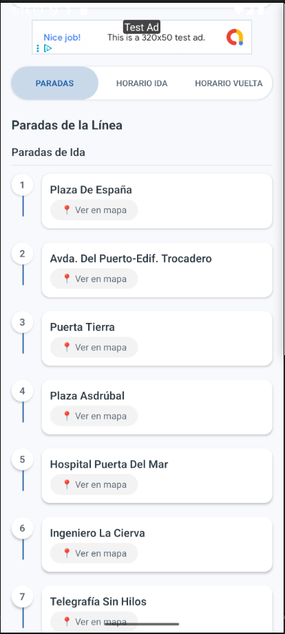
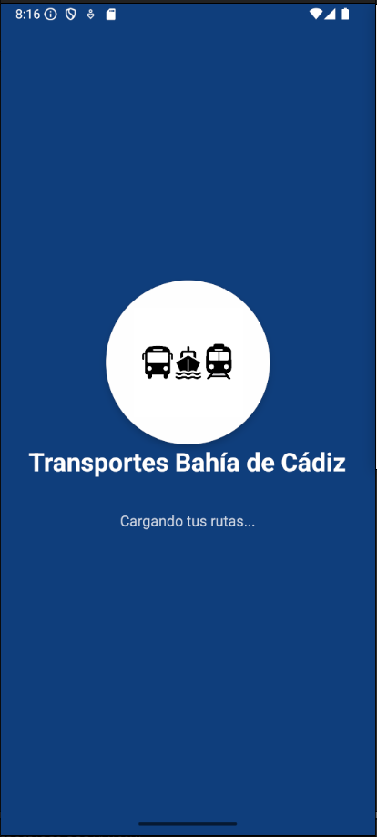
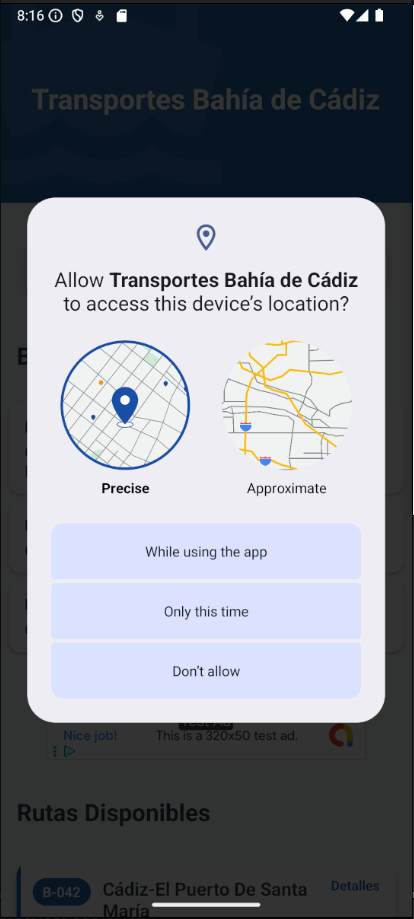

  <h1 style="color: white; font-size: 2.5rem; margin-bottom: 1rem;">Transportes Bahía de Cádiz</h1>
  <h2 style="color: white; font-weight: 400; max-width: 800px; margin: 0 auto 2rem;">Consulta rutas y horarios del bus interurbano en la Bahía de Cádiz de manera fácil y rápida</h2>
  

    
  

## Sobre la aplicación

  

    <strong style="color: var(--primary-dark);">Transportes Bahía de Cádiz</strong> es una aplicación diseñada para facilitar la consulta de rutas, horarios y paradas del transporte público interurbano en la Bahía de Cádiz. Gracias a la integración con la API oficial del Consorcio de Transportes de Andalucía, ofrece información actualizada y precisa sobre líneas de autobuses y operadores disponibles.
  

  

    "La forma más sencilla de moverte por la Bahía de Cádiz sin complicaciones"
  

## 🔍 Características principales

  

    
🔎

    
Búsqueda de rutas

    
Encuentra rutas por destino como hospitales, estaciones o lugares de interés.

  

  
  

    
🕒

    
Horarios detallados

    
Consulta horarios precisos de ida y vuelta para planificar tu viaje.

  

  
  

    
ℹ️

    
Información completa

    
Accede a datos sobre operadores, tipo de transporte y más.

  

  
  

    
📱

    
Interfaz intuitiva

    
Disfruta de una experiencia de usuario adaptada para todos los públicos.

  

  
  

    
📅

    
Compatibilidad calendario

    
Información adaptada para días laborables, festivos y domingos.

  

## Capturas de pantalla

  

    
    
Pantalla principal

  

  
  

    
    
Detalle de ruta

  

  
  

    
    
Horarios detallados

  

  
  

    
    
Información de parada

  

  
  

    
    
Carga de datos

  

  
  

    
    
Vista de mapa

  

## 🚌 Para quién es esta aplicación

  

    
🏠

    
Residentes

    
Habitantes de la Bahía de Cádiz que utilizan el transporte público regularmente.

  

  
  

    
🎓

    
Estudiantes

    
Jóvenes que necesitan desplazarse entre localidades para asistir a sus centros educativos.

  

  
  

    
🏖️

    
Turistas

    
Visitantes que quieren explorar la región sin complicaciones ni necesidad de vehículo propio.

  

  
  

    
💼

    
Trabajadores

    
Personas que se desplazan diariamente entre municipios por motivos laborales.

  

## Zonas cubiertas

  <h3 style="color: var(--primary-blue); margin-top: 0;">La aplicación incluye información del transporte interurbano entre:</h3>
  

    <ul style="list-style-type: none; padding-left: 0;">
      <li>✓ Cádiz</li>
      <li>✓ San Fernando</li>
      <li>✓ Chiclana</li>
      <li>✓ Puerto Real</li>
    </ul>
    <ul style="list-style-type: none; padding-left: 0;">
      <li>✓ El Puerto de Santa María</li>
      <li>✓ Jerez</li>
      <li>✓ Y otras localidades cercanas</li>
    </ul>
  

## Descarga e instalación

  <h2>Disponible en:</h2>
  

    
  

  
¡Simplifica tus desplazamientos por la Bahía de Cádiz con nuestra app!

<footer style="background-color: #252525; color: #e8e8e8; padding: 2rem 0; margin-top: 3rem; text-align: center; border-radius: 8px;" class="site-footer">
  

    

      

        <h3 style="color: var(--primary-light);">Transportes Bahía de Cádiz</h3>
        
Tu compañero de viaje para moverte por la Bahía de Cádiz de manera rápida y eficiente.

      

      

        <h3 style="color: var(--primary-light);">Contacto</h3>
        
¿Tienes alguna pregunta o sugerencia? No dudes en contactarnos.

      

    

    

      
© {{ 'now' | date: "%Y" }} Transportes Bahía de Cádiz. Todos los derechos reservados.

    

  

</footer>
